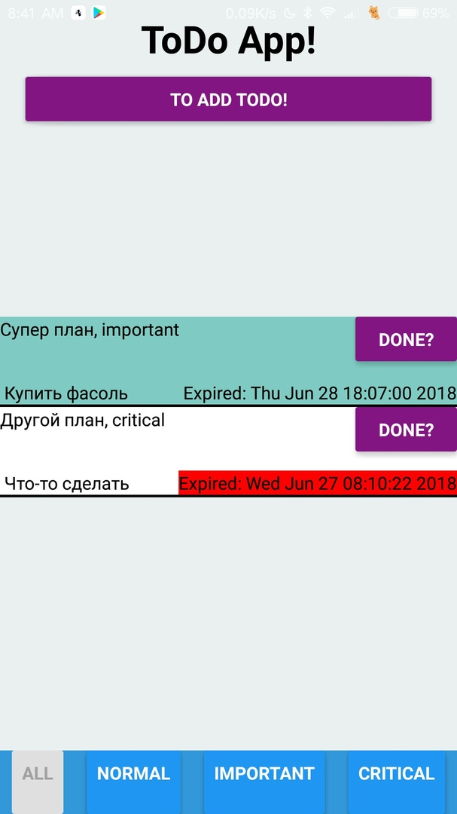
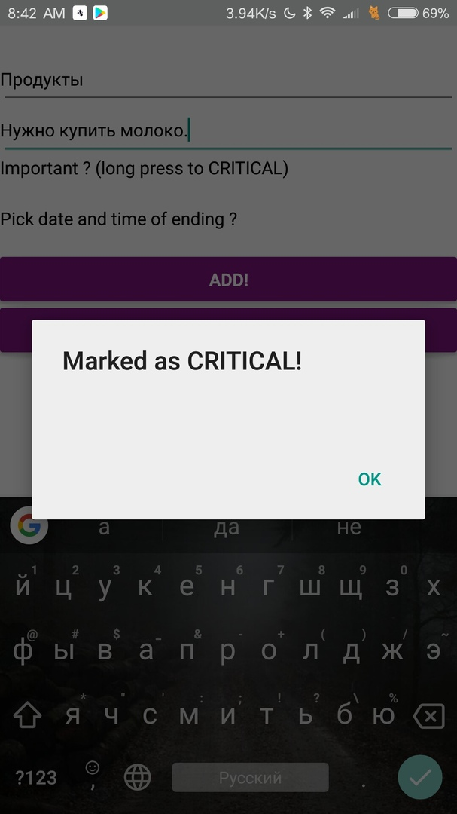

Its a simple todo application created via framework React Native.
Only for android! By now.

## Scripts
To install run
```
npm install
```
For testing run
```
npm run android
```
## Used packages
  1. expo - for hotreloading
  2. prop-types - typechecking
  3. React - base for react Native apps
  4. react-Native - base for react Native apps
  5. react-redux - link between redux and react
  6. redux - state container
  7. redux-persist - storage

## Features
  1. Adding todos (push "to add todo!" button)
  2. Editing todos (tap on todo)
  3. Deleting todos (hold on todo)
  4. Todo can expired (date becomes red)
  5. Todo can be completed (push button "done?")
  6. You can mark todo as IMPORTANT or CRITICAL (tap on "important" line in todo creation window, hold if you want make in "critical")
  7. You can add expiry date (in todo creation window tap "pick date" line)
  8. Filter by marks (bottom buttons)
  9. Todo have: name, body, mark and you can make it timed (and choose date and time) or not
## Screenshots
 
